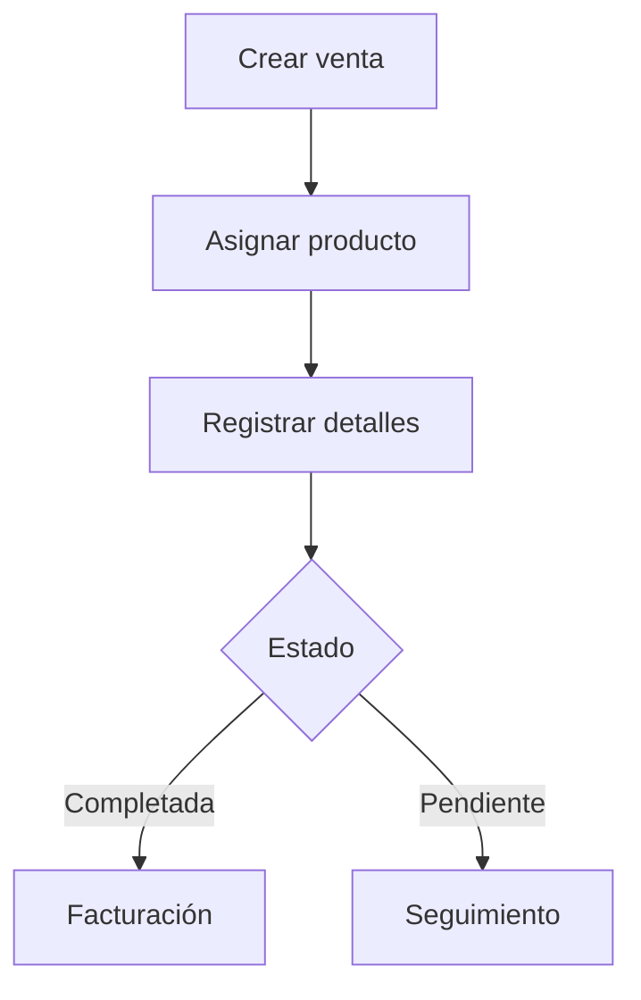

# Documentación Completa del Sistema CRM CallCenter

## 1. Introducción
### 1.1 Propósito
Sistema CRM para gestión de call center con:
- Seguimiento de empresas
- Gestión de ventas
- Registro de llamadas
- Asignación de operadores

### 1.2 Características Clave
- Interfaz operador optimizada
- Flujos de trabajo predefinidos
- Reportes en tiempo real

## 2. Arquitectura
### 2.1 Stack Tecnológico
- Backend: Laravel 10
- Frontend: Filament PHP
- DB: PostgreSQL

## 3. Módulos Principales
### 3.1 Módulo de Empresas (Company)

#### Modelo (app/Models/Company.php)
```php
protected $fillable = [
    'cif', 'name', 'address', 'phone', 'email',
    'follow_up_date', // Fecha de seguimiento
    'status', // Estado actual
    'assigned_operator_id' // Operador asignado
];

protected $casts = [
    'follow_up_date' => 'datetime',
    'last_contact_at' => 'datetime'
];
```

#### Estados (app/Enums/CompanyStatus.php)
```php
case Contactada = 'contactada';
case Seguimiento = 'seguimiento';
case Error = 'error';
```

#### Recurso Filament (app/Filament/Resources/CompanyResource.php)
```php
public static function form(Form $form): Form
{
    return $form->schema([
        Forms\Components\TextInput::make('name')->required(),
        Forms\Components\DatePicker::make('follow_up_date')
            ->native(false)
            ->displayFormat('d-m-Y H:i')
            ->format('Y-m-d H:i:s')
    ]);
}
```

#### Relaciones Clave
```php
public function operator() {
    return $this->belongsTo(User::class, 'assigned_operator_id');
}

public function calls() {
    return $this->hasMany(Call::class);
}
```

### 3.2 Módulo de Llamadas (Call)

#### Modelo (app/Models/Call.php)
```php
protected $fillable = [
    'call_date',
    'result', // 'contacto', 'volver_a_llamar', 'error'
    'notes',
    'company_id',
    'user_id'
];
```

#### Página Llamada Manual (app/Filament/Pages/Operator/LlamadaManualPage.php)
#### Flujo Principal:
1. Operador selecciona empresa
2. Registra detalles de llamada
3. Selecciona resultado:
   - Contacto: Programa seguimiento para mañana
   - Volver a llamar: Selecciona fecha específica
   - Error: Marca empresa como no contactable

#### Código Clave:
```php
public function submit() {
    $data = $this->form->getState();
    
    switch ($data['result']) {
        case 'volver_a_llamar':
            // Programar fecha específica
            break;
        case 'contacto':
            // Seguimiento automático
            break;
    }
}
```

#### Validaciones:
- Fecha requerida para 'volver a llamar'
- Notas obligatorias para 'error'
- Límite de llamadas por día por operador

### 3.3 Módulo de Ventas (Sale)

#### Modelo (app/Models/Sale.php)
```php
protected $fillable = [
    'sale_date',
    'amount',
    'status', // 'pendiente', 'completada', 'cancelada'
    'company_id',
    'product_id',
    'user_id'
];
```

#### Páginas Relacionadas
1. **SeguimientoDeVentas.php**: Ventas en proceso
2. **VentasPendientesDeTramitar.php**: Ventas por finalizar

#### Flujo de Venta


## 4. Anexos Técnicos

### 4.1 Migraciones Clave
```bash
# Ver estado de migraciones
php artisan migrate:status

# Ejecutar migraciones
php artisan migrate
```

### 4.2 Comandos Artisan
```bash
# Resetear asignaciones
php artisan crm:reset-assignments

# Generar reportes
php artisan crm:generate-reports
```

### 4.3 Consultas SQL Útiles
```sql
-- Empresas con seguimiento atrasado
SELECT id, name, follow_up_date 
FROM companies 
WHERE follow_up_date < NOW() 
AND status = 'seguimiento';

-- Ventas por operador
SELECT u.name, COUNT(s.id) as ventas
FROM sales s
JOIN users u ON s.user_id = u.id
GROUP BY u.name;
```

### 4.4 Diagrama ER Completo
```mermaid
erDiagram
    COMPANY ||--o{ CALL : has
    COMPANY ||--o{ SALE : has
    USER ||--o{ COMPANY : assigned
    USER ||--o{ SALE : made
    PRODUCT ||--o{ SALE : in
    
    COMPANY {
        string cif
        string name
        datetime follow_up_date
    }
    
    SALE {
        date sale_date
        decimal amount
    }

## 5. Instalación y Configuración

### 5.1 Requisitos del Sistema
- PHP 8.2+
- PostgreSQL 13+
- Composer 2.5+
- Node.js 18+ (para assets)

### 5.2 Proceso de Instalación
```bash
# Clonar repositorio
git clone https://github.com/tu-repositorio/crm-callcenter.git
cd crm-callcenter

# Instalar dependencias
composer install
npm install

# Configurar entorno
cp .env.example .env
php artisan key:generate

# Configurar base de datos
# Editar .env con credenciales

# Migrar y poblar datos
php artisan migrate --seed
php artisan storage:link

# Iniciar servidor de desarrollo
php artisan serve
```

### 5.3 Variables de Entorno Clave
```env
DB_CONNECTION=pgsql
DB_HOST=127.0.0.1
DB_PORT=5432
DB_DATABASE=crm_callcenter
DB_USERNAME=postgres
DB_PASSWORD=

APP_LOCALE=es
APP_TIMEZONE=Europe/Madrid
```

## 6. Troubleshooting

### 6.1 Problemas Comunes

**Problema**: Fechas no se muestran correctamente
- Verificar que el campo exista en la tabla
- Confirmar casts en el modelo
- Chequear timezone en config/app.php

**Problema**: Llamadas no se registran
- Revisar logs en storage/logs/laravel.log
- Verificar permisos de usuario
- Chequear relaciones en la base de datos

### 6.2 Monitoreo
```bash
# Ver logs en tiempo real
tail -f storage/logs/laravel.log

# Ver colas de trabajo
php artisan queue:work
```

## 7. Mantenimiento

### 7.1 Backup de Datos
```bash
# Backup completo (PostgreSQL)
pg_dump -U usuario -h localhost crm_callcenter > backup_$(date +%F).sql
```

### 7.2 Actualización del Sistema
```bash
git pull origin main
composer install
php artisan migrate
```

## 8. Roadmap y Mejoras Futuras
- Integración con sistemas de email
- API para integraciones externas
- Dashboard avanzado de métricas

## 9. Contacto y Soporte
Para soporte técnico contactar a:
- Email: soporte@alicantania.com
- Teléfono: +34 900 000 000

---

**Documentación generada el 04/06/2025**
**Versión del sistema: 2.5.0**
